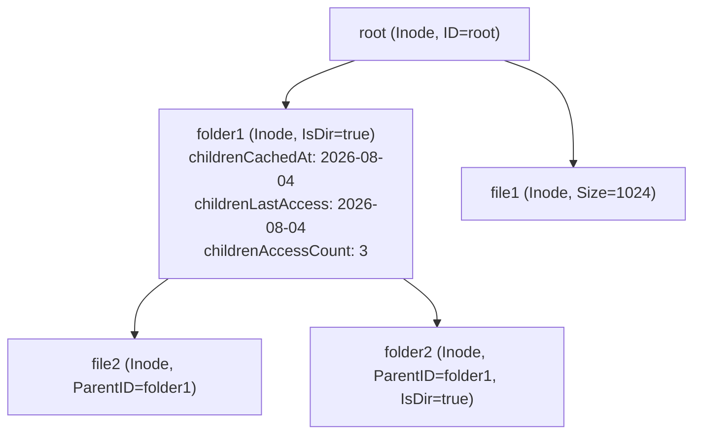
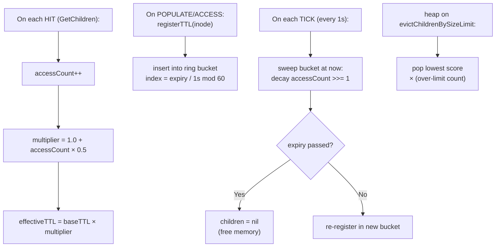
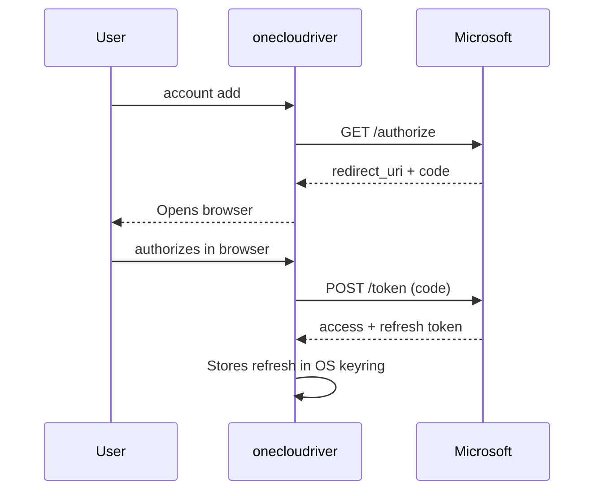
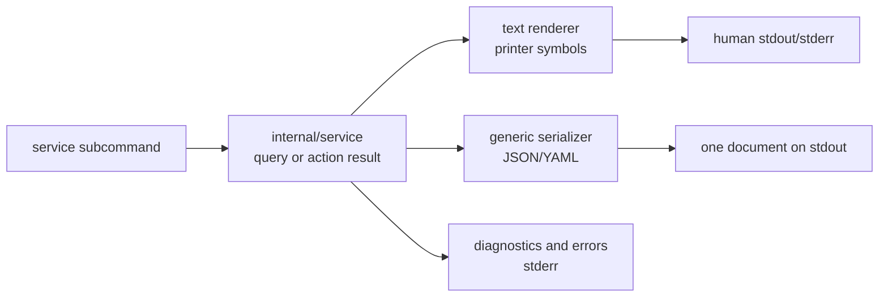

# onecloudriver Architecture

> Native file system for OneDrive on Linux using FUSE + Microsoft Graph API.

---

## Overview

onecloudriver mounts your OneDrive account as a local file system on Linux, allowing you to read, write, create, and delete files and folders directly from any application. It implements multi-level caching (memory + disk), bidirectional delta synchronization, offline mode, and asynchronous uploads with retries.


---

## Data Layer: InodeCache

### Tree Structure



Each `Inode` is a thread-safe wrapper around `graph.DriveItem` that adds:

| Field | Type | Purpose |
|---|---|---|
| `children` | `[]string` | Child IDs (nil = not initialized) |
| `childrenCachedAt` | `time.Time` | When children were populated (for freshness) |
| `childrenLastAccess` | `time.Time` | Last access to children (for eviction) |
| `childrenAccessCount` | `uint64` | Counter with decay (for LFU scoring) |
| `hasChanges` | `bool` | Unuploaded local changes (write-back) |
| `subdir` | `uint32` | Subdirectories (for NLink = 2 + subdir) |
| `mode` | `uint32` | UNIX permissions (0644 files, 0755 folders) |

### Persistence (BoltDB)

```
~/.cache/onecloudriver/<account>/inodes.db
├── bucket "metadata": id → JSON(SerializeableInode)
└── bucket "delta":    "link" → deltaURL
```

- **SerializeAll()**: dumps `sync.Map` → BoltDB on unmount
- **DeserializeFromDisk()**: loads BoltDB → `sync.Map` on mount
- **SaveUploadSession()**: persists incomplete upload sessions

### Smart Eviction (TTL+LFU)



Two structures split eviction between the two phases of `#66`:

- **TTL sweep — time-bucket ring (Phase 5-6):** each inode with cached children is
  registered in one of 60 ring buckets indexed by its effective expiry
  (`ChildrenLastAccess + effectiveTTL`, byte-aligned to 1s). A 1s ticker sweeps
  only the current bucket (~1/60 of the entries per tick) instead of the whole
  map: `O(entries in the overdue bucket)` vs `O(N)` for the old full scan.
  On an overdue bucket it applies the same decay as the reference full scan
  (accessCount >>= 1) and evicts folders whose TTL passed, re-registering the
  still-fresh ones. Duplicate registrations are discarded lazily.
- **Size eviction — persistent min-heap (Phase 8):** `evictChildrenBySizeLimit`
  pops the lowest-scored folders from a `container/heap` of `evictionEntry`
  (scored by `accessCount / (minutesSinceLastAccess + 1)`, oldest cachedAt on
  ties) until the folder count returns below `maxEntries`. Registrations carry a
  generation that invalidates stale entries lazily when they are popped.

The reference full-map sweep (`evictExpiredChildrenFullScan`) is kept for the
Fase-7 parity tests; production sweeping uses the bucket ring.

**Freshness vs. Eviction:** Freshness uses `childrenCachedAt` (anchored) to decide refetch. Eviction uses `childrenLastAccess` (sliding) to decide what to free. This prevents stale data from being served indefinitely.

---

## Data Layer: ContentCache

### Structure

```
~/.cache/onecloudriver/<account>/content/
├── <remote_id_1>    ← file downloaded from OneDrive
├── <remote_id_2>
├── local_<uuid>     ← locally created file (not yet uploaded)
└── ...
```

| Field | Type | Purpose |
|---|---|---|
| `directory` | `string` | Path on disk |
| `fds` | `sync.Map` | id → `*os.File` (reusable FDs) |
| `meta` | `sync.Map` | id → `*contentMeta` (accessCount, lastAccess) |
| `maxSize` | `int64` | Limit in bytes (0 = unlimited) |
| `currentSize` | `atomic.Int64` | Current size on disk |
| `evictMu` | `sync.Mutex` | Serializes eviction vs. file creation |

### Zero-copy reads

```go
fd, _ := contentCache.Open(id)
return fuse.ReadResultFd(fd.Fd(), offset, size)
```

The FD is reused between reads. Data is not copied to user space.

### Age-based eviction

- Sweeps files by `mtime` (age on disk)
- **Never** evicts files with `IsOpen(id) == true`
- `evictMu` serializes check + deletion (prevents TOCTOU race with `Open()`)
- Score = `accessCount / (minutesSinceLastAccess + 1)`

---

## Communication with Microsoft Graph

### Authentication Flow



### Used Endpoints

| Operation | Method | Endpoint |
|---|---|---|
| List children | GET | `/me/drive/items/{id}/children` |
| Item metadata | GET | `/me/drive/items/{id}` |
| Search by path | GET | `/me/drive/root:/path` |
| Download content | GET | `/me/drive/items/{id}/content` (with Range) |
| Upload file (≤4MB) | PUT | `/me/drive/items/{parentId}:/{name}:/content` |
| Upload file (>4MB) | POST | `/me/drive/items/{parentId}:/{name}:/createUploadSession` |
| Create folder | POST | `/me/drive/items/{parentId}/children` |
| Delete | DELETE | `/me/drive/items/{id}` |
| Rename | PATCH | `/me/drive/items/{id}` |
| Move | PATCH | `/me/drive/items/{id}` (with parentReference) |
| Delta | GET | `/me/drive/root/delta` |

---

## Offline Mode

When there is no internet connection:

1. `fetchChildrenWithOffline()` detects `isNetworkError(err)` → `SetOffline(true)`
2. **Read:** serves metadata from `InodeCache` (memory + BoltDB)
3. **Content:** serves files from `ContentCache` (local disk)
4. **Write:** buffered locally (write-back); the `UploadManager` uploads it in the background once the connection returns (structural mutations such as create/delete still fail with `EIO` because they require Graph)
5. Upon regaining connection: `SetOffline(false)` automatically

---

## Systemd Service and Structured Output

The optional `service` command manages a **user-level systemd template unit**:

```text
~/.config/systemd/user/onecloudriver@.service
```

Each configured account is an instance of that template, for example
`onecloudriver@user@example.com.service`. The unit uses the systemd `%i` instance specifier so instances do not share
a mountpoint. The packaged template uses `%h` for the home directory:

```text
ExecStart=/usr/local/bin/onecloudriver mount %h/OneDrive/%i -a %i
ExecStop=/bin/fusermount3 -uz %h/OneDrive/%i
```

For a unit generated by `service install`, a leading `~/` is normalized to the
user's absolute home path before it is written; `%i` remains in the mountpoint.

- `%h` expands to the user's home directory in the packaged template.
- `%i` expands to the account instance name.
- The unit is generated by `internal/service` and executed through
  `systemctl --user`.
- `service list` discovers installed instances, including disabled, stopped,
  and never-started units.
- `service status ACCOUNT` queries detailed state and best-effort journal data;
  a successfully queried failed unit is valid status data, not a query error.

### Mountpoint template resolution

`service install` resolves the template mountpoint in this order:

1. An explicit `--mountpoint` flag.
2. The account's saved `defaultMountpoint`, **only when it contains `%i`**.
3. The fallback `~/OneDrive/%i`, expanded to the user's absolute home path.

The interactive `mount` command persists the last successful concrete path in
`defaultMountpoint`. A concrete saved path without `%i` is therefore unsafe for
the shared `@.service` template: reusing it would make multiple accounts mount
at the same directory. `service install` ignores that value, emits a warning,
and uses the per-instance fallback instead.

### Presentation boundary

The CLI keeps human-oriented text rendering separate from machine-readable
serialization:



All service subcommands inherit `--output/-o` (`text`, `json`, or `yaml`). In
structured modes stdout contains exactly one document; diagnostics, warnings,
and systemd progress remain on stderr. Action commands return `ActionResult`,
which can include a non-fatal `warning` when a concrete saved mountpoint was
ignored. See [`service-output.md`](service-output.md) for the complete output
contract and [`api/service.md`](api/service.md) for the internal API reference.

---

## CLI Configuration

```
onecloudriver mount /mnt/onedrive -a user@outlook.com \
  --cache-dir=/path/to/cache \
  --cache-ttl=120s \
  --cache-max-entries=5000 \
  --cache-max-size=2GB
```

| Flag | Default | Description |
|---|---|---|
| `--cache-dir` | `~/.cache/onecloudriver/<account>` | Cache tree root (session only, never persisted) |
| `--cache-ttl` | `60s` | Metadata base TTL |
| `--cache-max-entries` | `2000` | Max folders with cached children |
| `--cache-max-size` | `0` (unlimited) | ContentCache maximum size |
