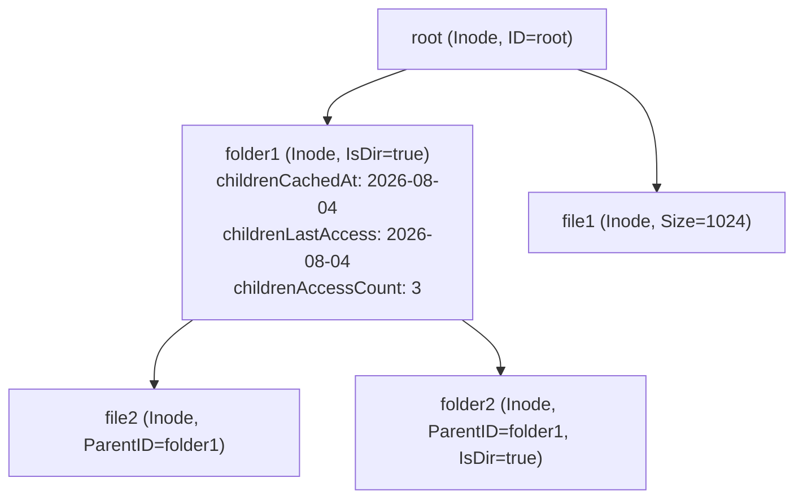
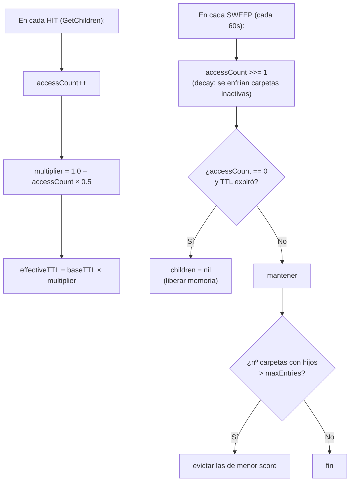
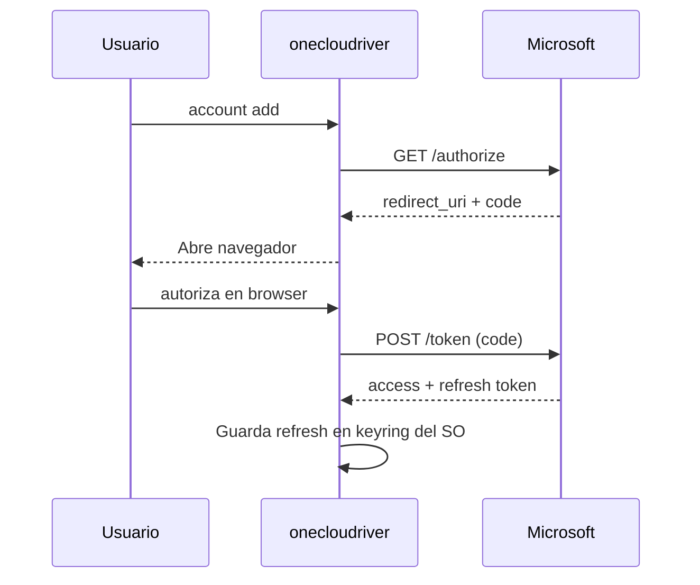

# Arquitectura de onecloudriver

> Sistema de archivos nativo para OneDrive en Linux usando FUSE + Microsoft Graph API.

---

## Visión general

onecloudriver monta tu cuenta de OneDrive como un sistema de archivos local en Linux, permitiendo leer, escribir, crear y borrar archivos y carpetas directamente desde cualquier aplicación. Implementa caché multinivel (memoria + disco), sincronización delta bidireccional, modo offline, y subidas asíncronas con reintentos.


---

## Capa de datos: InodeCache

### Estructura del árbol



Cada `Inode` es un wrapper thread-safe alrededor de `graph.DriveItem` que añade:

| Campo | Tipo | Propósito |
|---|---|---|
| `children` | `[]string` | IDs de hijos (nil = no inicializado) |
| `childrenCachedAt` | `time.Time` | Cuándo se poblaron los hijos (para frescura) |
| `childrenLastAccess` | `time.Time` | Último acceso a los hijos (para evicción) |
| `childrenAccessCount` | `uint64` | Contador con decay (para scoring LFU) |
| `hasChanges` | `bool` | Cambios locales sin subir (write-back) |
| `subdir` | `uint32` | Subdirectorios (para NLink = 2 + subdir) |
| `mode` | `uint32` | Permisos UNIX (0644 archivos, 0755 carpetas) |

### Persistencia (BoltDB)

```
~/.cache/onecloudriver/<cuenta>/inodes.db
├── bucket "metadata": id → JSON(SerializeableInode)
└── bucket "delta":    "link" → deltaURL
```

- **SerializeAll()**: vuelca `sync.Map` → BoltDB al desmontar
- **DeserializeFromDisk()**: carga BoltDB → `sync.Map` al montar
- **SaveUploadSession()**: persiste sesiones de subida incompletas

### Evicción inteligente (TTL+LFU)



**Frescura vs. Evicción:** La frescura usa `childrenCachedAt` (anclado) para decidir refetch. La evicción usa `childrenLastAccess` (deslizante) para decidir qué liberar. Esto evita que datos obsoletos se sirvan indefinidamente.

---

## Capa de datos: ContentCache

### Estructura

```
~/.cache/onecloudriver/<cuenta>/content/
├── <id_remoto_1>    ← archivo descargado de OneDrive
├── <id_remoto_2>
├── local_<uuid>     ← archivo creado localmente (aún no subido)
└── ...
```

| Campo | Tipo | Propósito |
|---|---|---|
| `directory` | `string` | Ruta en disco |
| `fds` | `sync.Map` | id → `*os.File` (FDs reutilizables) |
| `meta` | `sync.Map` | id → `*contentMeta` (accessCount, lastAccess) |
| `maxSize` | `int64` | Límite en bytes (0 = sin límite) |
| `currentSize` | `atomic.Int64` | Tamaño actual en disco |
| `evictMu` | `sync.Mutex` | Serializa evicción vs. creación de archivos |

### Zero-copy reads

```go
fd, _ := contentCache.Open(id)
return fuse.ReadResultFd(fd.Fd(), offset, size)
```

El FD se reutiliza entre lecturas. No se copian datos a espacio de usuario.

### Evicción age-based

- Barre archivos por `mtime` (edad en disco)
- **Nunca** evicta archivos con `IsOpen(id) == true`
- `evictMu` serializa chequeo + borrado (previene TOCTOU race con `Open()`)
- Score = `accessCount / (minutosDesdeLastAccess + 1)`

---

## Comunicación con Microsoft Graph

### Flujo de autenticación



### Endpoints usados

| Operación | Método | Endpoint |
|---|---|---|
| Listar hijos | GET | `/me/drive/items/{id}/children` |
| Metadata ítem | GET | `/me/drive/items/{id}` |
| Buscar por ruta | GET | `/me/drive/root:/path` |
| Descargar contenido | GET | `/me/drive/items/{id}/content` (con Range) |
| Subir archivo (≤4MB) | PUT | `/me/drive/items/{parentId}:/{name}:/content` |
| Subir archivo (>4MB) | POST | `/me/drive/items/{parentId}:/{name}:/createUploadSession` |
| Crear carpeta | POST | `/me/drive/items/{parentId}/children` |
| Eliminar | DELETE | `/me/drive/items/{id}` |
| Renombrar | PATCH | `/me/drive/items/{id}` |
| Mover | PATCH | `/me/drive/items/{id}` (con parentReference) |
| Delta | GET | `/me/drive/root/delta` |

---

## Modo offline

Cuando no hay conexión a internet:

1. `fetchChildrenWithOffline()` detecta `isNetworkError(err)` → `SetOffline(true)`
2. **Lectura:** sirve metadatos desde `InodeCache` (memoria + BoltDB)
3. **Contenido:** sirve archivos desde `ContentCache` (disco local)
4. **Escritura:** almacenada localmente (write-back); el `UploadManager` la sube en segundo plano al recuperar la conexión (las mutaciones estructurales como crear/borrar siguen fallando con `EIO` porque requieren Graph)
5. Al recuperar conexión: `SetOffline(false)` automáticamente

---

## Configuración CLI

```
onecloudriver mount /mnt/onedrive -a user@outlook.com \
  --cache-dir=/path/to/cache \
  --cache-ttl=120s \
  --cache-max-entries=5000 \
  --cache-max-size=2GB
```

| Flag | Default | Descripción |
|---|---|---|
| `--cache-dir` | `~/.cache/onecloudriver/<cuenta>` | Raíz del árbol de caché |
| `--cache-ttl` | `60s` | TTL base de metadatos |
| `--cache-max-entries` | `2000` | Máx. carpetas con hijos cacheados |
| `--cache-max-size` | `0` (sin límite) | Tamaño máximo de ContentCache |
