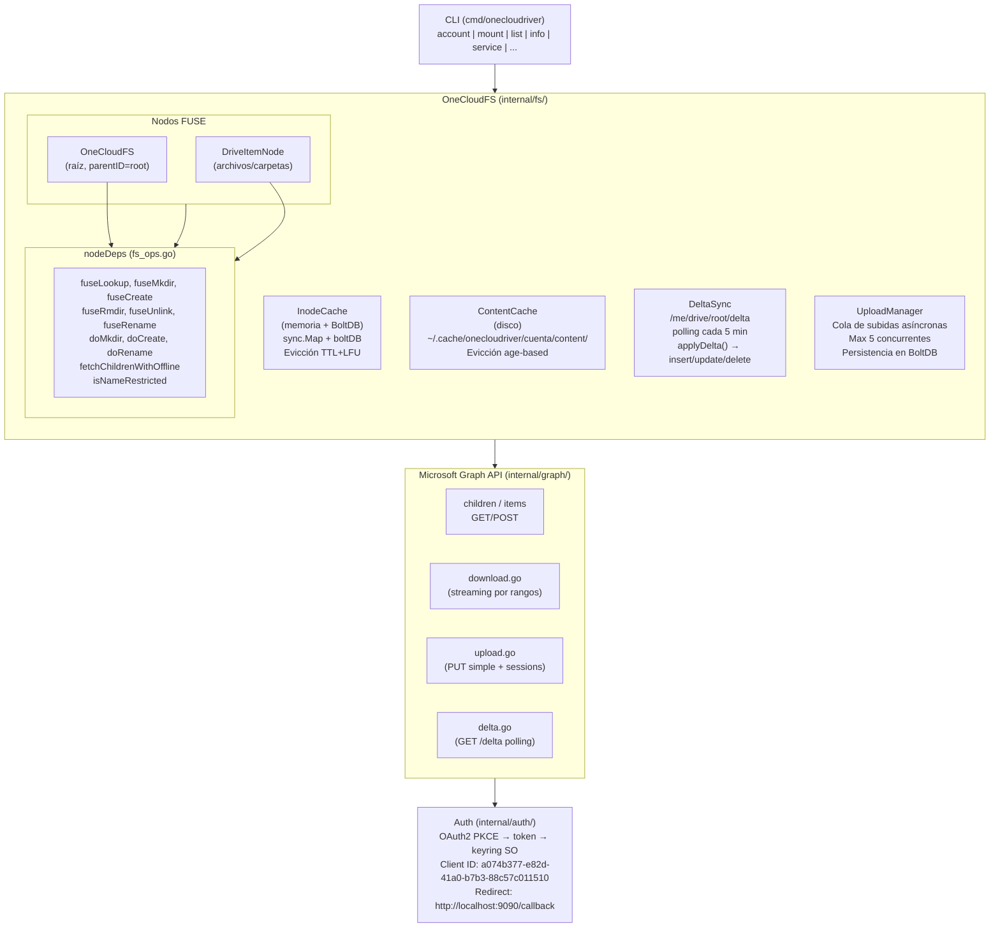
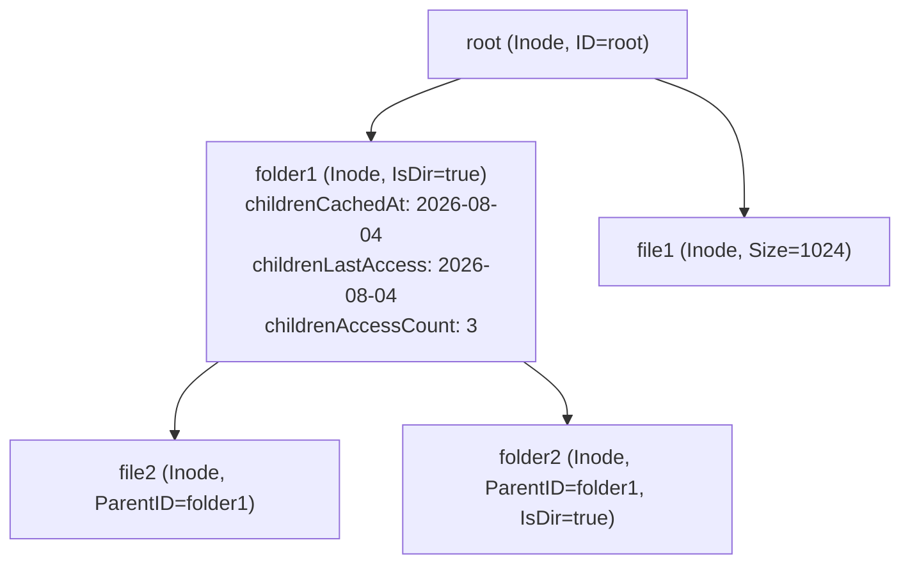
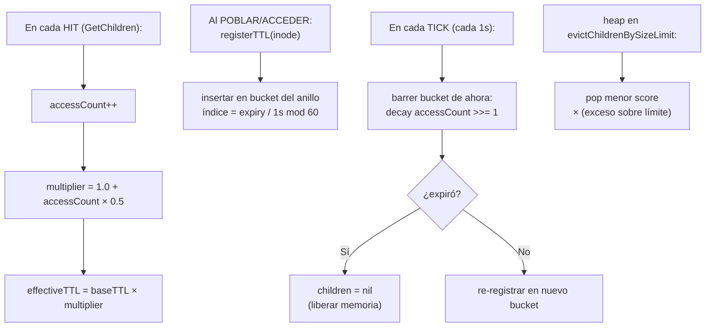
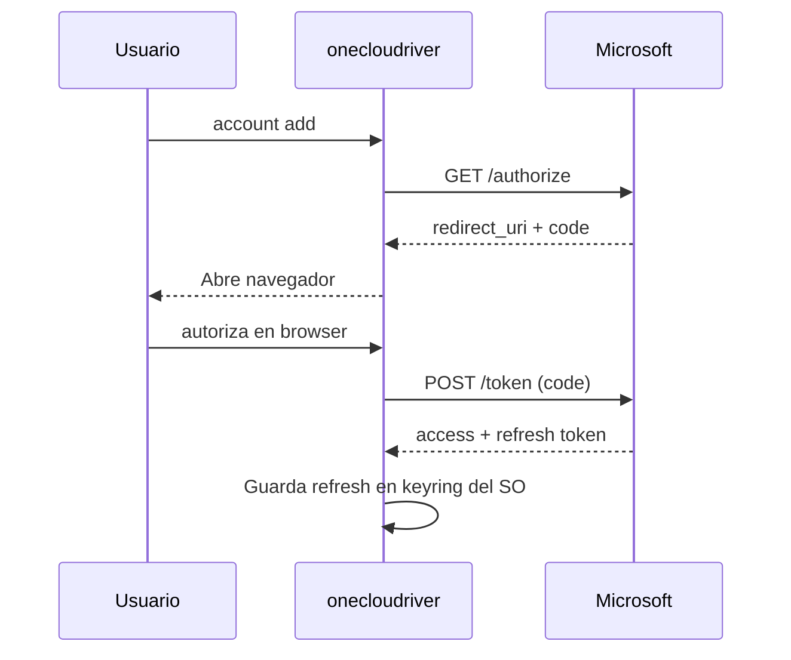
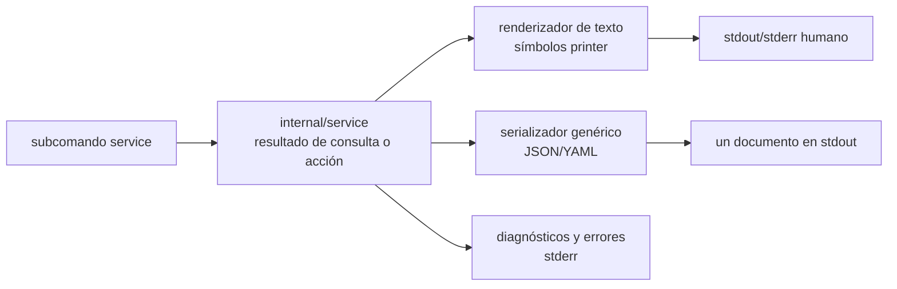

# Arquitectura de onecloudriver

> Sistema de archivos nativo para OneDrive en Linux usando FUSE + Microsoft Graph API.

---

## Visión general

onecloudriver monta tu cuenta de OneDrive como un sistema de archivos local en Linux, permitiendo leer, escribir, crear y borrar archivos y carpetas directamente desde cualquier aplicación. Implementa caché multinivel (memoria + disco), sincronización delta bidireccional, modo offline, y subidas asíncronas con reintentos.



---

## Capa de datos: InodeCache

### Estructura del árbol



Cada `Inode` es un wrapper thread-safe alrededor de `graph.DriveItem` que añade:

| Campo | Tipo | Propósito |
|---|---|---|
| `children` | `[]string` | IDs de hijos (nil = no inicializado) |
| `childrenCachedAt` | `time.Time` | Cuándo se poblaron los hijos (para frescura) |
| `childrenLastAccess` | `time.Time` | Último acceso a los hijos (para evicción) |
| `childrenAccessCount` | `uint64` | Contador con decay (para scoring LFU) |
| `hasChanges` | `bool` | Cambios locales sin subir (write-back) |
| `subdir` | `uint32` | Subdirectorios (para NLink = 2 + subdir) |
| `mode` | `uint32` | Permisos UNIX (0644 archivos, 0755 carpetas) |

### Persistencia (BoltDB)

```
~/.cache/onecloudriver/<cuenta>/inodes.db
├── bucket "metadata": id → JSON(SerializeableInode)
└── bucket "delta":    "link" → deltaURL
```

- **SerializeAll()**: vuelca `sync.Map` → BoltDB al desmontar
- **DeserializeFromDisk()**: carga BoltDB → `sync.Map` al montar
- **SaveUploadSession()**: persiste sesiones de subida incompletas

### Evicción inteligente (TTL+LFU)



Dos estructuras reparten la evicción entre las dos fases de la `#66`:

- **Sweep TTL — anillo de buckets temporales (Fases 5-6):** cada inode con hijos
  cacheados se registra en uno de los 60 buckets del anillo indexado por su
  expiración efectiva (`ChildrenLastAccess + effectiveTTL`, alineado a 1s). Un
  ticker de 1s barre solo el bucket actual (~1/60 de las entradas por tick) en
  lugar de todo el mapa: `O(entradas del bucket vencido)` frente a `O(N)` del
  antiguo full scan. En un bucket vencido aplica el mismo decay que el full scan
  de referencia (accessCount >>= 1) y evicta las carpetas cuyo TTL pasó,
  re-registrando las todavía frescas. Los registros duplicados se descartan
  perezosamente.
- **Evicción por tamaño — min-heap persistente (Fase 8):**
  `evictChildrenBySizeLimit` hace pop de las carpetas de menor score desde un
  `container/heap` de `evictionEntry` (score = `accessCount / (minutosDesdeLastAccess + 1)`,
  la más antigua por cachedAt en empates) hasta que el nº de carpetas vuelve a
  estar bajo `maxEntries`. Cada registro lleva una generación que invalida a las
  entradas obsoletas perezosamente al hacer pop.

El full scan de referencia (`evictExpiredChildrenFullScan`) se conserva para los
tests de paridad de la Fase 7; en producción el barrido usa el anillo de buckets.

**Frescura vs. Evicción:** La frescura usa `childrenCachedAt` (anclado) para decidir refetch. La evicción usa `childrenLastAccess` (deslizante) para decidir qué liberar. Esto evita que datos obsoletos se sirvan indefinidamente.

---

## Capa de datos: ContentCache

### Estructura

```
~/.cache/onecloudriver/<cuenta>/content/
├── <id_remoto_1>    ← archivo descargado de OneDrive
├── <id_remoto_2>
├── local_<uuid>     ← archivo creado localmente (aún no subido)
└── ...
```

| Campo | Tipo | Propósito |
|---|---|---|
| `directory` | `string` | Ruta en disco |
| `fds` | `sync.Map` | id → `*os.File` (FDs reutilizables) |
| `meta` | `sync.Map` | id → `*contentMeta` (accessCount, lastAccess) |
| `maxSize` | `int64` | Límite en bytes (0 = sin límite) |
| `currentSize` | `atomic.Int64` | Tamaño actual en disco |
| `evictMu` | `sync.Mutex` | Serializa evicción vs. creación de archivos |

### Zero-copy reads

```go
fd, _ := contentCache.Open(id)
return fuse.ReadResultFd(fd.Fd(), offset, size)
```

El FD se reutiliza entre lecturas. No se copian datos a espacio de usuario.

### Evicción age-based

- Barre archivos por `mtime` (edad en disco)
- **Nunca** evicta archivos con `IsOpen(id) == true`
- `evictMu` serializa chequeo + borrado (previene TOCTOU race con `Open()`)
- Score = `accessCount / (minutosDesdeLastAccess + 1)`

---

## Comunicación con Microsoft Graph

### Flujo de autenticación



### Endpoints usados

| Operación | Método | Endpoint |
|---|---|---|
| Listar hijos | GET | `/me/drive/items/{id}/children` |
| Metadata ítem | GET | `/me/drive/items/{id}` |
| Buscar por ruta | GET | `/me/drive/root:/path` |
| Descargar contenido | GET | `/me/drive/items/{id}/content` (con Range) |
| Subir archivo (≤4MB) | PUT | `/me/drive/items/{parentId}:/{name}:/content` |
| Subir archivo (>4MB) | POST | `/me/drive/items/{parentId}:/{name}:/createUploadSession` |
| Crear carpeta | POST | `/me/drive/items/{parentId}/children` |
| Eliminar | DELETE | `/me/drive/items/{id}` |
| Renombrar | PATCH | `/me/drive/items/{id}` |
| Mover | PATCH | `/me/drive/items/{id}` (con parentReference) |
| Delta | GET | `/me/drive/root/delta` |

---

## Modo offline

Cuando no hay conexión a internet:

1. `fetchChildrenWithOffline()` detecta `isNetworkError(err)` → `SetOffline(true)`
2. **Lectura:** sirve metadatos desde `InodeCache` (memoria + BoltDB)
3. **Contenido:** sirve archivos desde `ContentCache` (disco local)
4. **Escritura:** almacenada localmente (write-back); el `UploadManager` la sube en segundo plano al recuperar la conexión (las mutaciones estructurales como crear/borrar siguen fallando con `EIO` porque requieren Graph)
5. Al recuperar conexión: `SetOffline(false)` automáticamente

---

## Servicio systemd y salida estructurada

El comando opcional `service` gestiona una **plantilla de unidad systemd de
usuario**:

```text
~/.config/systemd/user/onecloudriver@.service
```

Cada cuenta configurada es una instancia de esa plantilla, por ejemplo
`onecloudriver@usuario@example.com.service`. La unidad usa el specifier de instancia `%i` de systemd para que las instancias
no compartan el mountpoint. La plantilla empaquetada usa `%h` para el directorio
home:

```text
ExecStart=/usr/local/bin/onecloudriver mount %h/OneDrive/%i -a %i
ExecStop=/bin/fusermount3 -uz %h/OneDrive/%i
```

En una unidad generada por `service install`, un `~/` inicial se normaliza a la
ruta absoluta del home antes de escribirla; `%i` se conserva en el mountpoint.

- `%h` se expande al directorio home en la plantilla empaquetada.
- `%i` se expande al nombre de la instancia de cuenta.
- La unidad se genera desde `internal/service` y se ejecuta mediante
  `systemctl --user`.
- `service list` descubre las instancias instaladas, incluidas las unidades
  deshabilitadas, detenidas y nunca iniciadas.
- `service status CUENTA` consulta el estado detallado y, cuando es posible,
  las últimas líneas del journal; una unidad consultada correctamente en
  estado fallido es un dato válido, no un error de consulta.

### Resolución de la plantilla de mountpoint

`service install` resuelve el mountpoint de la plantilla en este orden:

1. El flag explícito `--mountpoint`.
2. El `defaultMountpoint` guardado de la cuenta, **solo si contiene `%i`**.
3. El fallback `~/OneDrive/%i`, expandido a la ruta absoluta del home.

El comando interactivo `mount` persiste la última ruta concreta usada con éxito
en `defaultMountpoint`. Por tanto, una ruta guardada sin `%i` no es segura para
la plantilla compartida `@.service`: reutilizarla haría que varias cuentas se
montasen en el mismo directorio. `service install` ignora ese valor, emite un
aviso y usa el fallback por instancia.

### Frontera de presentación

El CLI mantiene separada la representación humana de la serialización legible
por máquinas:



Todos los subcomandos de `service` heredan `--output/-o` (`text`, `json` o
`yaml`). En modo estructurado, stdout contiene exactamente un documento; los
diagnósticos, avisos y progreso de systemd permanecen en stderr. Las acciones
devuelven `ActionResult`, que puede incluir un `warning` no fatal cuando se
ignora un mountpoint concreto guardado. Consulta
[`service-output.es.md`](service-output.es.md) para el contrato completo y
[`api/service.md`](api/service.md) para la referencia de la API interna.

---

## Configuración CLI

```
onecloudriver mount /mnt/onedrive -a user@outlook.com \
  --cache-dir=/path/to/cache \
  --cache-ttl=120s \
  --cache-max-entries=5000 \
  --cache-max-size=2GB
```

| Flag | Default | Descripción |
|---|---|---|
| `--cache-dir` | `~/.cache/onecloudriver/<cuenta>` | Raíz del árbol de caché (solo sesión, nunca se persiste) |
| `--cache-ttl` | `60s` | TTL base de metadatos |
| `--cache-max-entries` | `2000` | Máx. carpetas con hijos cacheados |
| `--cache-max-size` | `0` (sin límite) | Tamaño máximo de ContentCache |
