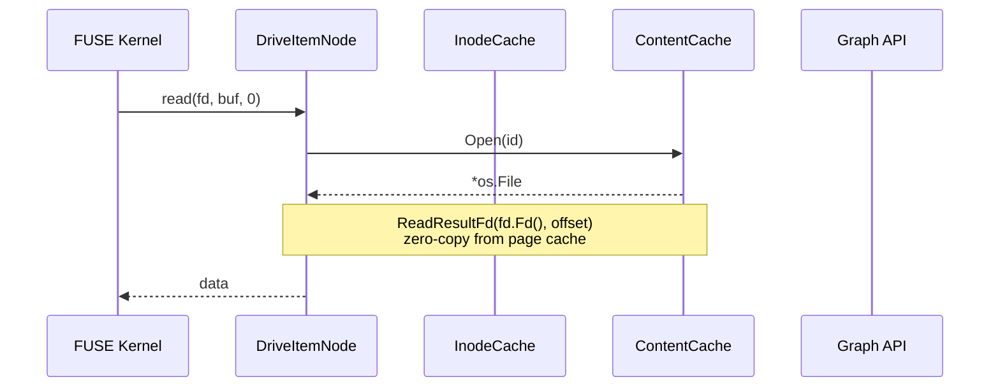
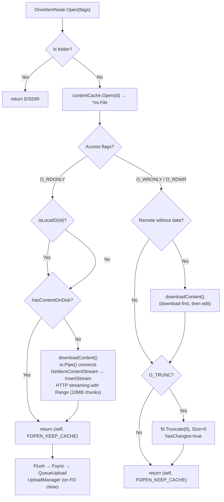
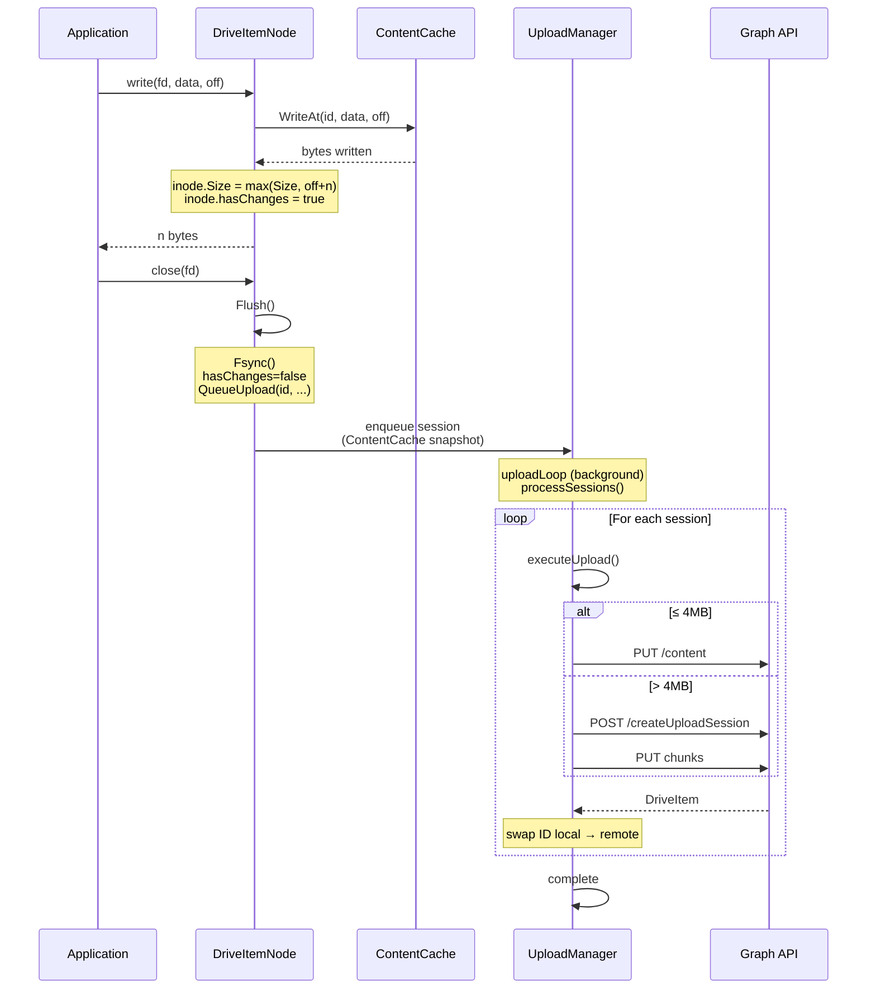
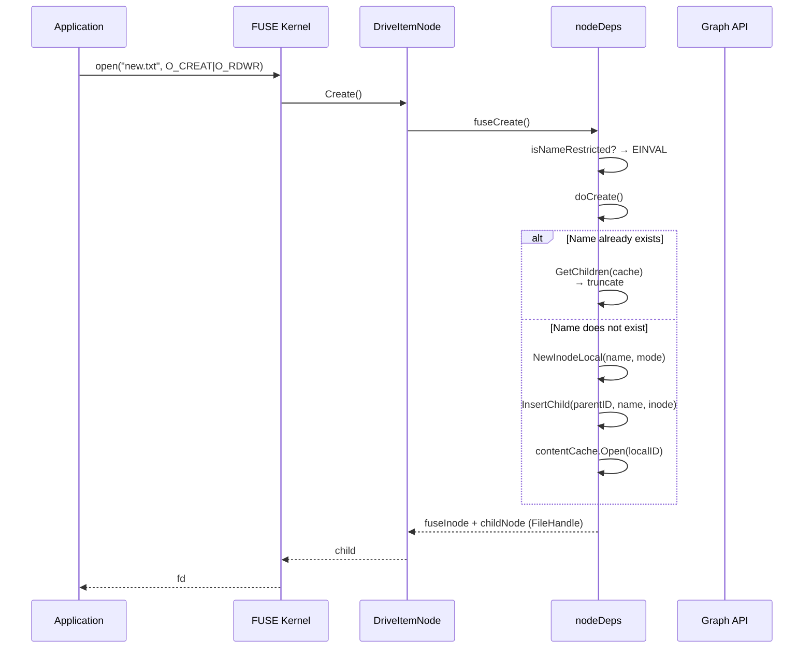
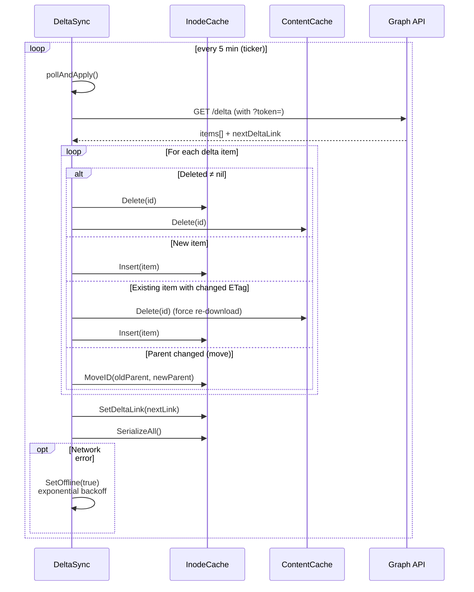
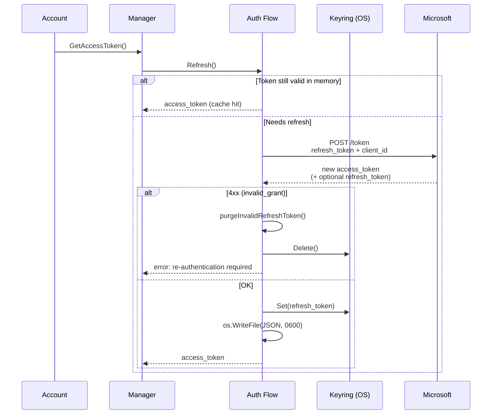
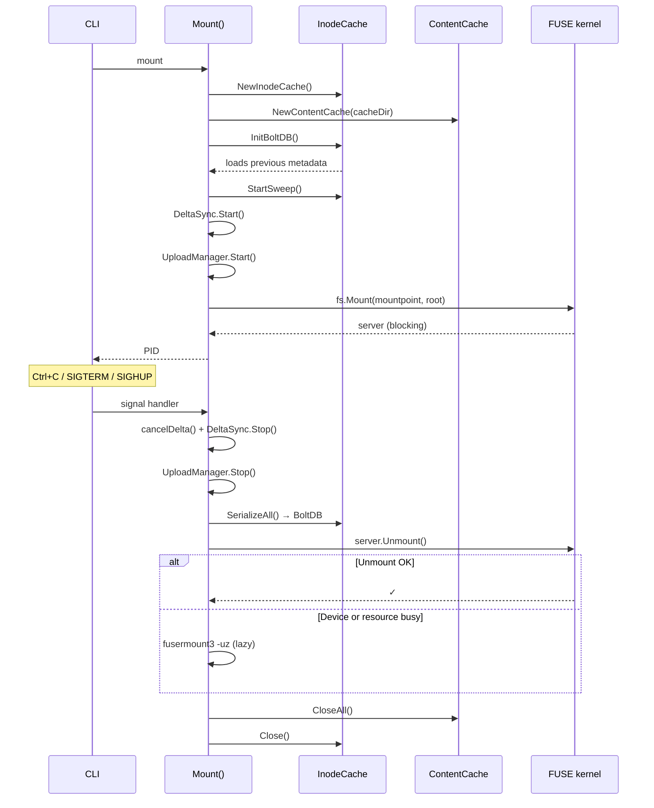
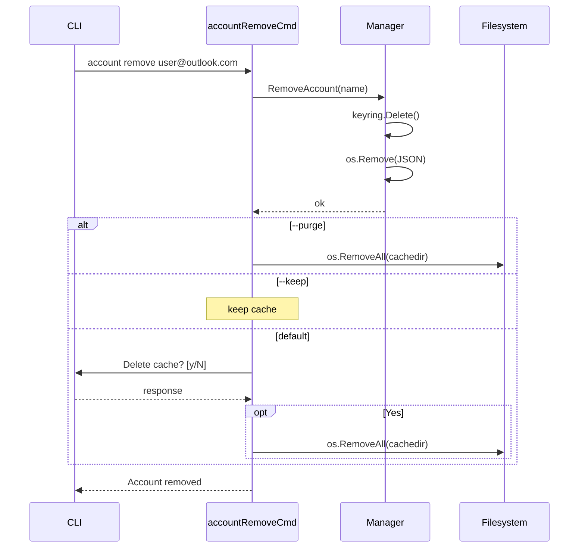
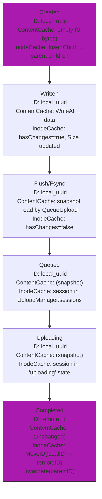

# Communication Flows in onecloudriver

> Detailed sequence diagrams of the main filesystem operations.

---

## 1. Read flow

### File open (Open) — detail

---

## 2. Write flow (Write → Flush → Upload)

---

## 3. File creation flow (Create)

---

## 4. Delta Sync flow (remote synchronization)

---

## 5. Authentication and token refresh flow

---

## 6. Mount and unmount flow

---

## 7. Account deletion with cache flow

---

## 8. Lifecycle of a local file (created offline → uploaded)

**ID swap:** after the first successful upload, the `Inode` changes its ID from `local_<uuid>` to the real OneDrive ID. References in the parent's `children` are updated with `MoveID()`.
