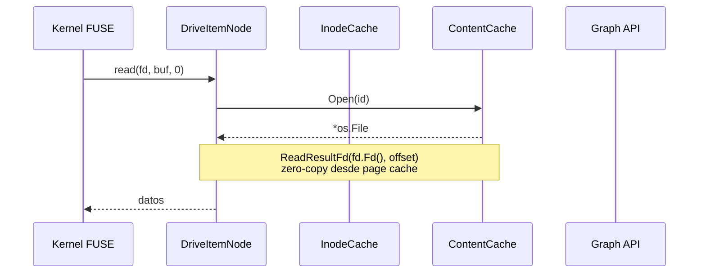
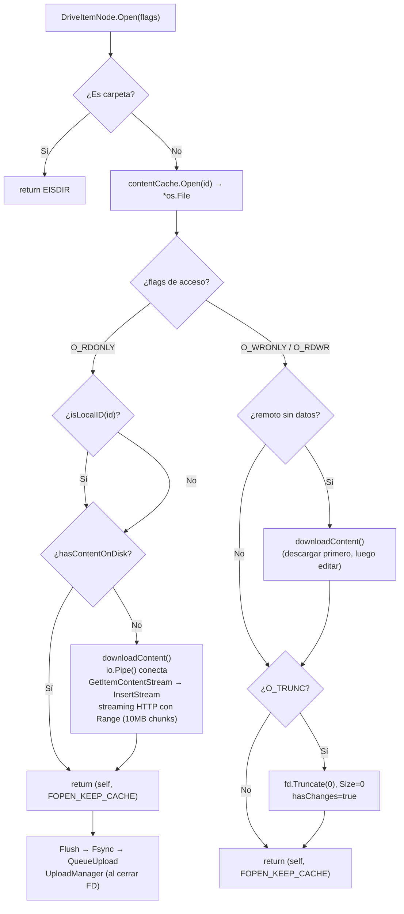
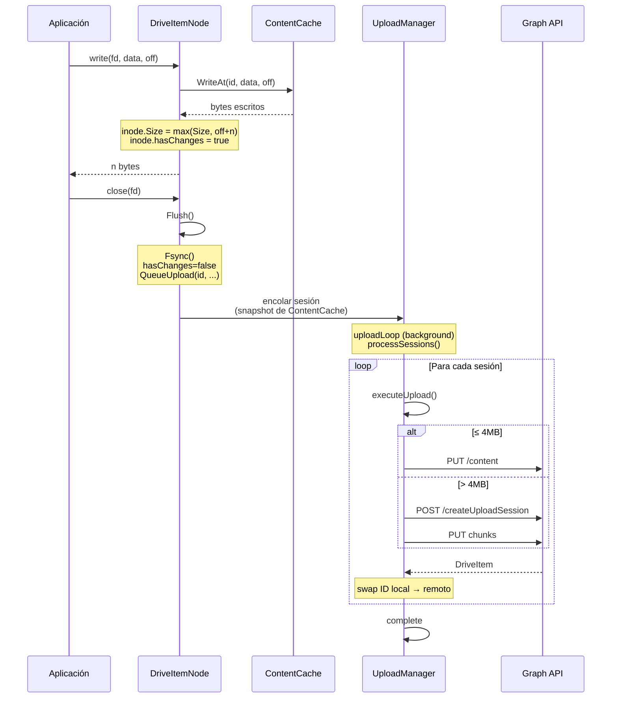
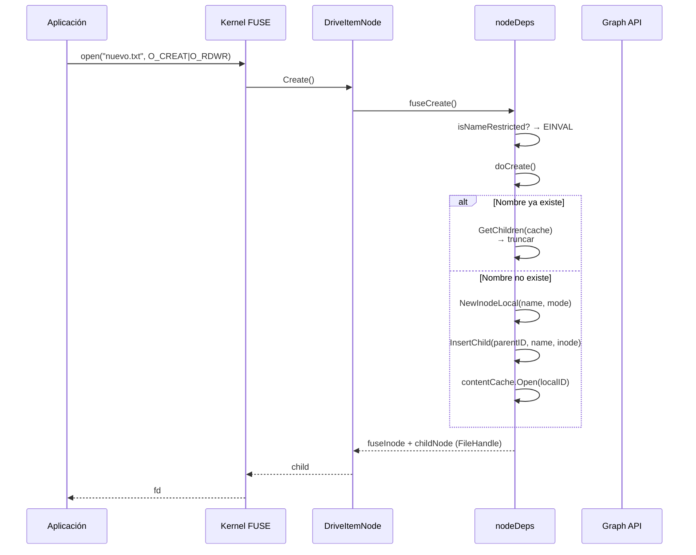
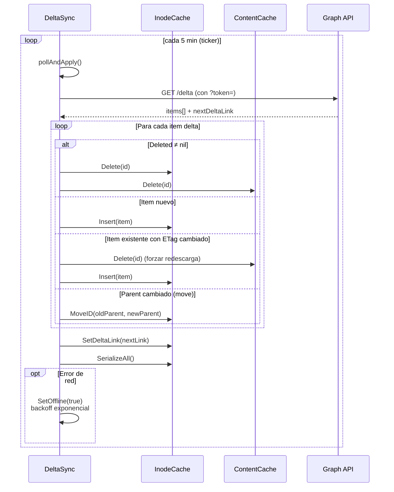
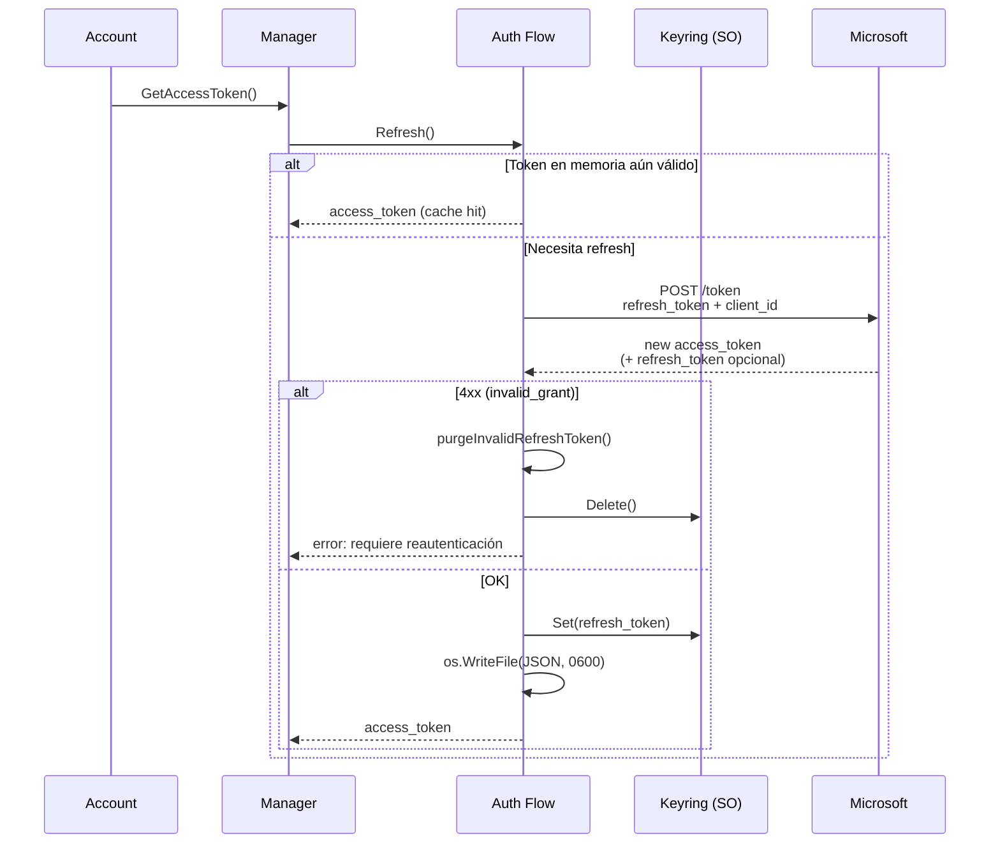
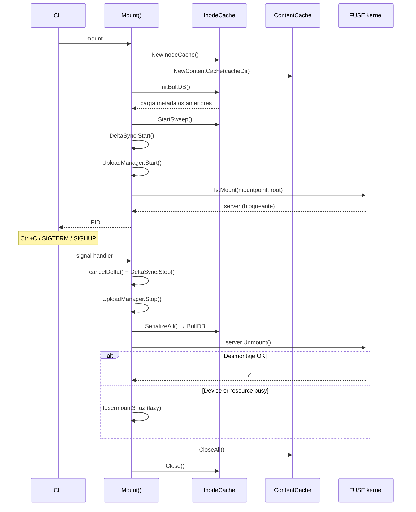
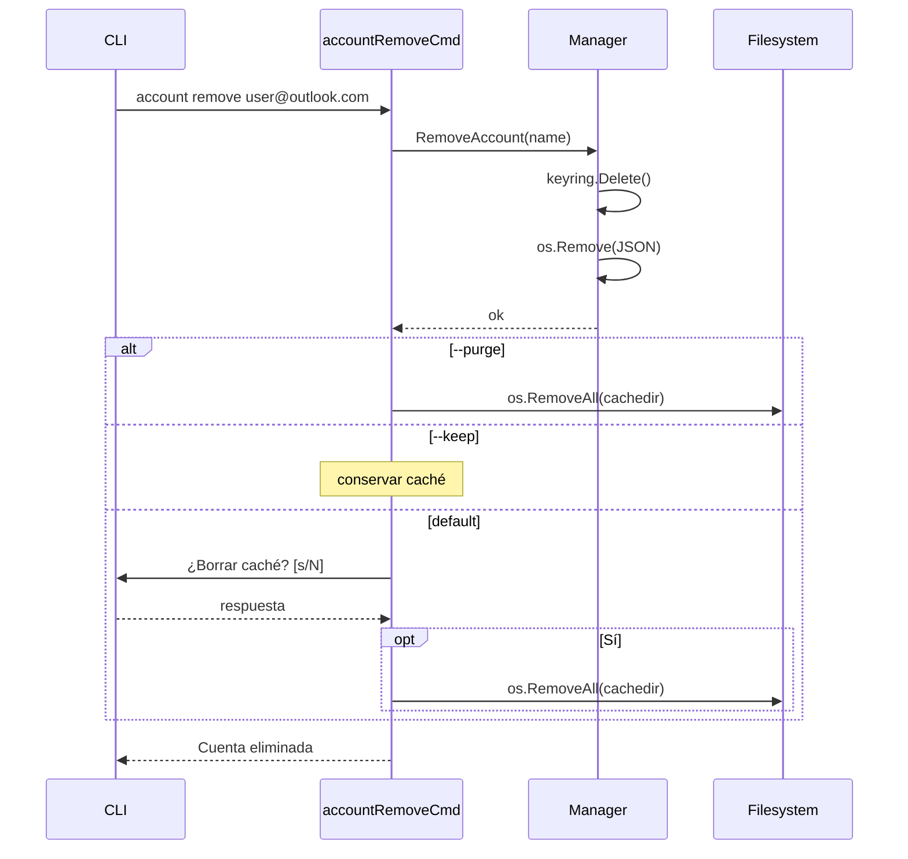
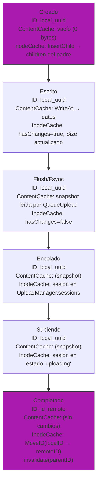

# Flujos de comunicación en onecloudriver

> Diagramas de secuencia detallados de las operaciones principales del sistema de archivos.

---

## 1. Flujo de lectura (Read)

### Apertura del archivo (Open) — detalle

---

## 2. Flujo de escritura (Write → Flush → Upload)

---

## 3. Flujo de creación de archivo (Create)

---

## 4. Flujo de Delta Sync (sincronización remota)

---

## 5. Flujo de autenticación y refresh de tokens

---

## 6. Flujo de montaje y desmontaje

---

## 7. Flujo de borrado de cuenta con caché

---

## 8. Ciclo de vida de un archivo local (creado offline → subido)

**Swap de ID:** tras la primera subida exitosa, el `Inode` cambia su ID de `local_<uuid>` al ID real de OneDrive. Las referencias en `children` del padre se actualizan con `MoveID()`.
